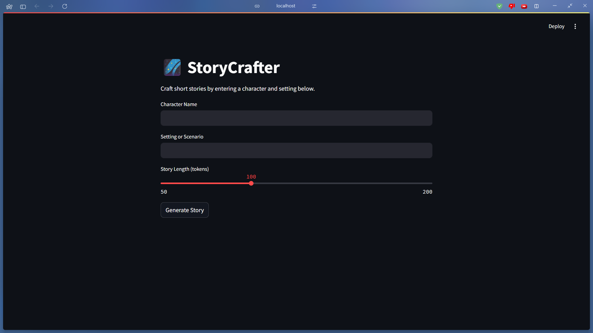
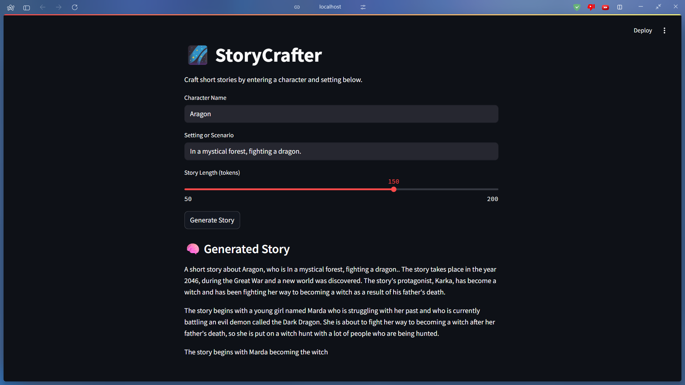
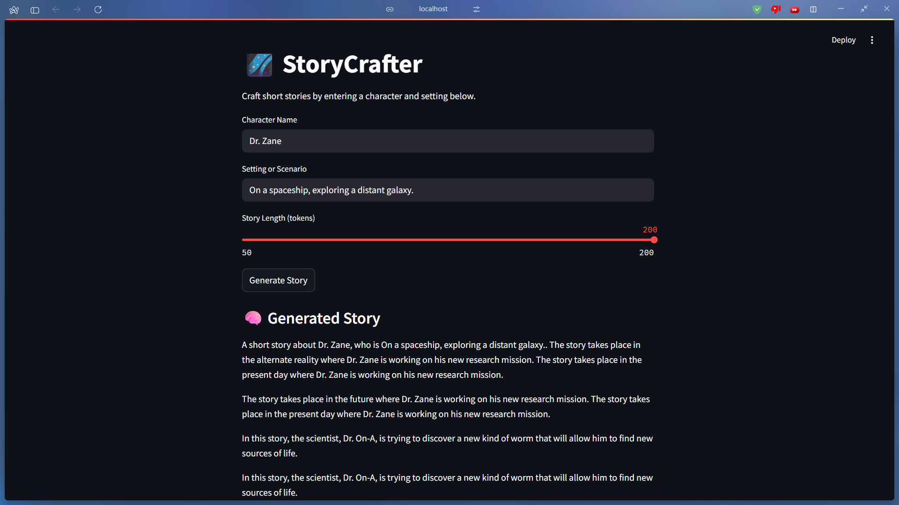
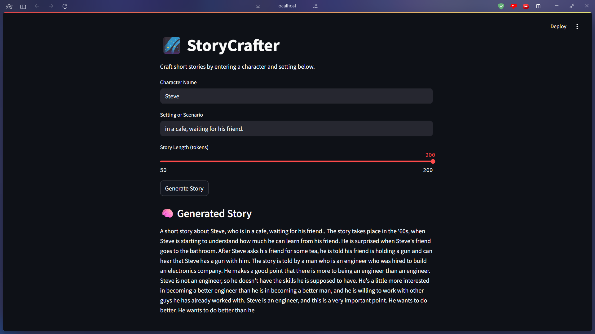

<div align="center">
  
  # Generative AI by AdroIT-IBM
  
  *Comprehensive curriculum, machine learning datasets, and final project from the Generative AI intensive course.*
  
  <br />

  
  
  
  
  
  
  

</div>

<br />

> [!NOTE]  
> This module encompasses the curriculum, machine learning datasets, Jupyter assignments, and the final project (**StoryCrafter**) completed during the rigorous **Generative AI** intensive course.

<br/>
<div align="center">
  
</div>

---

## 📸 Application Gallery

### StoryCrafter Home Interface
Below is the primary generation interface for prompt construction.

<div align="center">
  
</div>

<br/>

<details>
<summary>Click here to expand the full step-by-step UI walkthrough! (4 Screenshots)</summary>
<br/>

### Model Testing Flow
Detailed outputs of narrative generation through iterative prompt refinement and structure pacing.

<div align="center">
  
  
  <br/><br/>
  
  
</div>

</details>

---

## 🌌 Overview & System Features

**StoryCrafter** is an advanced Generative AI application built to dynamically construct, structure, and refine narrative storytelling. The application utilizes deep prompt engineering to help users flesh out story arcs and generate immersive narrative structures automatically.

### Core platform highlights:
* **Dynamic Narrative Generation:** Automatically construct full storylines, character developments, and dialogue trees from minimal starting prompts.
* **Story Arc Structuring:** Intelligent formatting of generated text into readable, well-paced arcs that maintain logical consistency.
* **Prompt Engineering Excellence:** Highly optimized context windows designed to significantly reduce AI hallucinations during prolonged generation.
* **Iterative Refinement:** Users can re-prompt to dynamically alter specific narrative directions mid-story without losing preceding context.

---

## 🛠️ Technology Stack

| Component | Technology | Description |
| :--- | :--- | :--- |
| **Language** | Python 3.8+ | Core scripting for all NLP and modeling tasks. |
| **Data Processing** | Pandas, NumPy | Dataframe manipulation, text extraction, and cleaning. |
| **Machine Learning** | Scikit-Learn | Implementing base classifiers for comparison testing. |
| **Interactive Dev** | Jupyter Notebooks | Executing stepwise generative blocks and visualizing outputs. |
| **Foundation Models** | IBM Watsonx | Leveraging `flan-t5-xxl` for deep text comprehension. |

---

## 🚀 Getting Started

Follow these step-by-step instructions to boot the Generative AI environments on your local machine.

### 1. Set Up Your Environment
Ensure you have Python installed. Open a terminal and navigate to the project directory:
```bash
# Create and activate a python virtual environment
python -m venv env

# On Windows:
env\Scripts\activate
# On macOS/Linux:
source env/bin/activate

# Install all core dependencies
pip install pandas scikit-learn jupyter
```

### 2. Run the Notebooks
Launch the Jupyter server to interact with the models directly.
```bash
# Launch the Jupyter Notebook server
jupyter notebook
```

> [!TIP]
> The server will open your default browser. Navigate into `assignments/car-rental/notebooks/` or `assignments/sentiment-analysis/notebooks/` and open any `.ipynb` file to execute the generation pipelines!

---

## 📚 Course Assignments

Throughout the curriculum, multiple comprehensive Jupyter Notebook assignments were completed to solidify Generative AI and NLP concepts:
- **Car Rental Analysis**: Leveraging generative AI to process and synthesize car rental feedback, complete with training and testing CSV datasets.
- **Legal Sentiment Analysis**: Utilizing scikit-learn and IBM's `flan-t5-xxl` foundation models to evaluate and categorize the sentiment of complex legal phrases.

---

## 🎓 Certifications Achieved

The rigorous curriculum culminated in the achievement of verified certificates from AdroIT and IBM.

<div align="center">
  
  <br/>
  
</div>

<br/>
<div align="center">
  <em>StoryCrafter</em>
  <br /><br />
  <p style="font-size: 13px; color: #8b949e; letter-spacing: 0.5px;">&mdash; Engineered by Kavya &mdash;</p>
</div>
