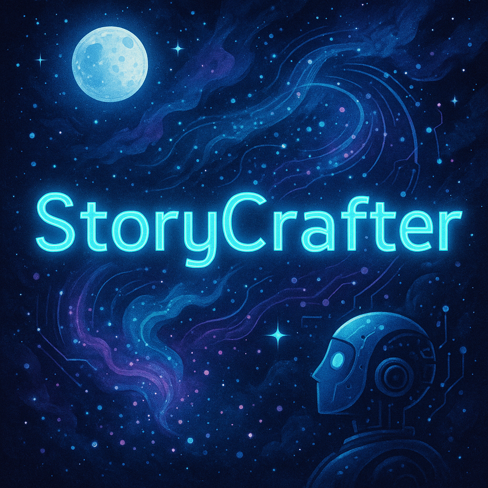

<div align="center">
  
  # Semester Internship - MERN and Gen AI
  
  *An advanced dual-track repository archiving comprehensive full-stack web development and applied generative AI curriculum.*
  
  <br />

  
  
  
  
  
  
  
  
  
  
  
  
  
  
  

</div>

<br />

> [!NOTE]  
> This repository was compiled between January and April 2025 as part of the academic curriculum for the **DSN2093 Semester Internship** at **VIT Bhopal University**. It represents the culmination of two highly intensive, industry-backed certification tracks: **Full Stack Developer MERN** (partnered with SmartBridge & MongoDB) and **Generative AI** (partnered with AdroIT & IBM).

---

## 🌌 Overview & Portfolio Tracks

This repository serves as a master archive, bridging the gap between dynamic, state-driven full-stack web applications and cutting-edge natural language processing models. It is cleanly divided into two major autonomous tracks, each containing their respective curriculums, weekly assignments, extensive SDLC documentation, and final deployed applications. 

### Track 1: Full Stack Web Development (MERN)
- **Focus:** Modern web architecture, global state management, RESTful APIs, and secure authentication.
- **Final Project (SpendSmart):** A robust personal finance tracker featuring secure JWT user authentication, real-time data visualization charts, and interactive transaction history modules.
- **Certifications:** SmartBridge Certificate of Completion & MongoDB Node.js Developer Proof of Completion.
- 🔗 **[Explore Track 1: SmartBridge-MERN](SmartBridge-MERN/)**

<br/>
<div align="center">
  
</div>

### Track 2: Generative Artificial Intelligence
- **Focus:** Deep prompt engineering, foundation model integration, sentiment analysis, and text synthesis.
- **Final Project (StoryCrafter):** An advanced generative AI application designed to dynamically construct, structure, and refine narrative storytelling using heavily optimized prompt windows.
- **Certifications:** AdroIT Certificate of Completion & IBM Watsonx Certificate.
- 🔗 **[Explore Track 2: AdroIT-GenAI](AdroIT-GenAI/)**

<br/>
<div align="center">
  
</div>

---

## 🛠️ Combined Technology Stack

| Component | Technology | Description |
| :--- | :--- | :--- |
| **Frontend UI** | React.js, Context API | Dynamic web client handling global state and responsive rendering. |
| **Backend API** | Node.js, Express.js | Highly responsive server managing endpoints and secure routing. |
| **Database & ORM** | MongoDB, Mongoose | NoSQL data storage handling complex transaction associations. |
| **Security** | JWT, bcrypt.js | Encrypted session handling and secure password hashing. |
| **Data Processing** | Python, Pandas | Deep data cleaning and dataframe manipulation for machine learning. |
| **Machine Learning** | Scikit-Learn | Statistical classifiers operating on complex datasets. |
| **Foundation Models** | IBM Watsonx | Advanced Large Language Models (`flan-t5-xxl`) for NLP generation. |

---

## 🧭 Rapid Navigation Guide

To evaluate the contents of this portfolio quickly, you can navigate directly to the core modules:
- **[SpendSmart Final Application](SmartBridge-MERN/project-SpendSmart/)**
- **[StoryCrafter Final Application](AdroIT-GenAI/project-StoryCrafter/)**
- **[SmartBridge MERN Certificates](SmartBridge-MERN/certificates/)**
- **[AdroIT Gen AI Certificates](AdroIT-GenAI/certificates/)**
- **[SpendSmart UI Screenshots](SmartBridge-MERN/project-SpendSmart/screenshots/)**
- **[StoryCrafter UI Screenshots](AdroIT-GenAI/project-StoryCrafter/screenshots/)**

---

## 📂 Project Architecture

```text
📦 DSN2093
 ┣ 📂 AdroIT-GenAI/                    # Track: Generative AI
 ┃ ┣ 📂 assignments/                   # Weekly project models and CSV datasets
 ┃ ┃ ┣ 📂 car-rental/                  # Generative AI car rental feedback synthesis
 ┃ ┃ ┗ 📂 sentiment-analysis/          # Legal sentiment evaluation via LLMs
 ┃ ┣ 📂 certificates/                  # AI Completion Certificates & Scorecards
 ┃ ┗ 📂 project-StoryCrafter/          # Final AI Project Application
 ┃   ┣ 📂 assets/                      # Application Cover Image
 ┃   ┣ 📂 docs/                        # Project Documentation
 ┃   ┗ 📂 screenshots/                 # StoryCrafter UI Previews
 ┣ 📂 SmartBridge-MERN/                # Track: Full Stack Web Development
 ┃ ┣ 📂 assignments/                   # HTML, CSS, React, and Express tasks
 ┃ ┣ 📂 certificates/                  # MERN Completion Certificates & Scorecards
 ┃ ┗ 📂 project-SpendSmart/            # Final MERN Project Application
 ┃   ┣ 📂 assets/                      # Application Cover Image
 ┃   ┣ 📂 docs/                        # SDLC Phases (Ideation to Final Report)
 ┃   ┣ 📂 screenshots/                 # SpendSmart UI Previews
 ┃   ┗ 📂 src/                         # Full Source Code (Frontend & Backend)
 ┗ 📜 README.md                        # Master Portfolio Documentation
```

---

## 📜 License

The **source code** for the projects (SpendSmart and StoryCrafter) in this repository is licensed under the [MIT License](LICENSE). 

> [!WARNING]  
> **Personal Property & Copyright Notice:** All personal certificates, scorecards, SDLC documentation, and academic credentials contained specifically within the following directory paths:
> - `AdroIT-GenAI/certificates/`
> - `AdroIT-GenAI/project-StoryCrafter/docs/`
> - `SmartBridge-MERN/certificates/`
> - `SmartBridge-MERN/project-SpendSmart/docs/`
> 
> are the exclusive personal property of **Kavya**. They are **strictly excluded** from the open-source MIT license and may not be copied, reproduced, or distributed under any circumstances.

---

## 🎓 Academic Origins & Contribution

This repository originated as an academic submission by [**Kavya**](https://github.com/varaxion) in the role of **Trainee**, as part of the **DSN2093 Semester Internship** course in 2025 at **VIT Bhopal University**, completed in collaboration with industry partners **SmartBridge-MongoDB** and **AdroIT-IBM**.

<br/>
<div align="center">
  <em>DSN2093 Semester Internship • MERN & Gen AI Dual Portfolio</em>
  <br /><br />
  <p style="font-size: 13px; color: #8b949e; letter-spacing: 0.5px;">&mdash; Archived by Kavya &mdash;</p>
</div>
