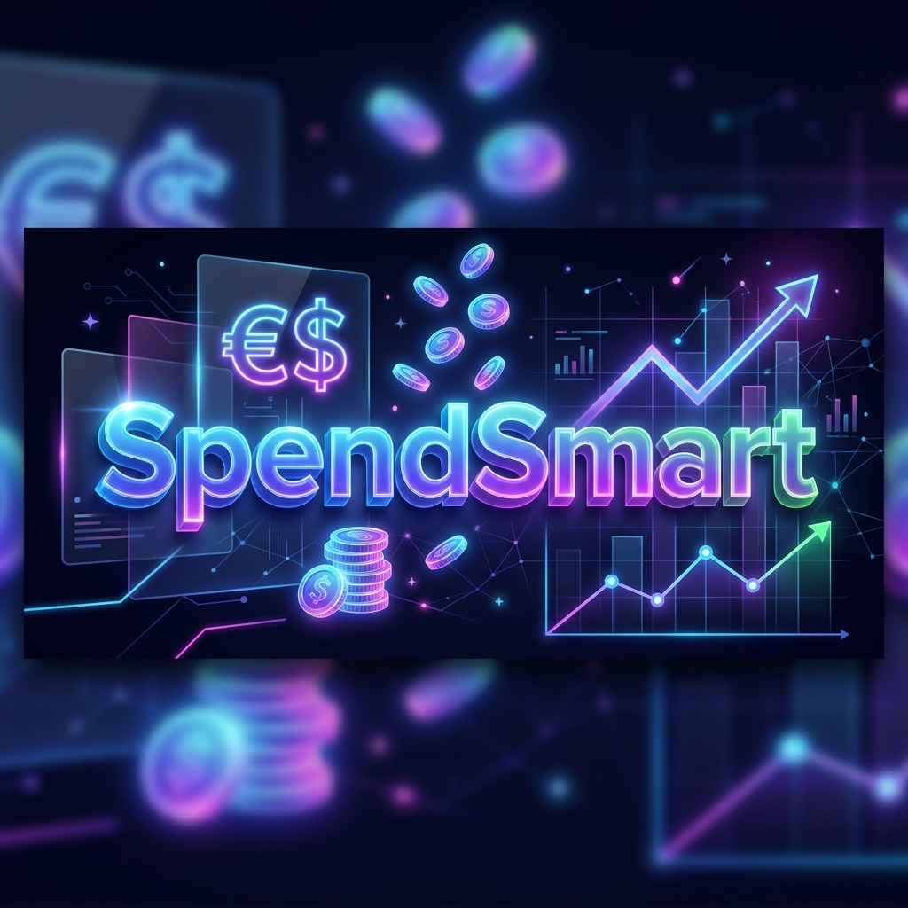
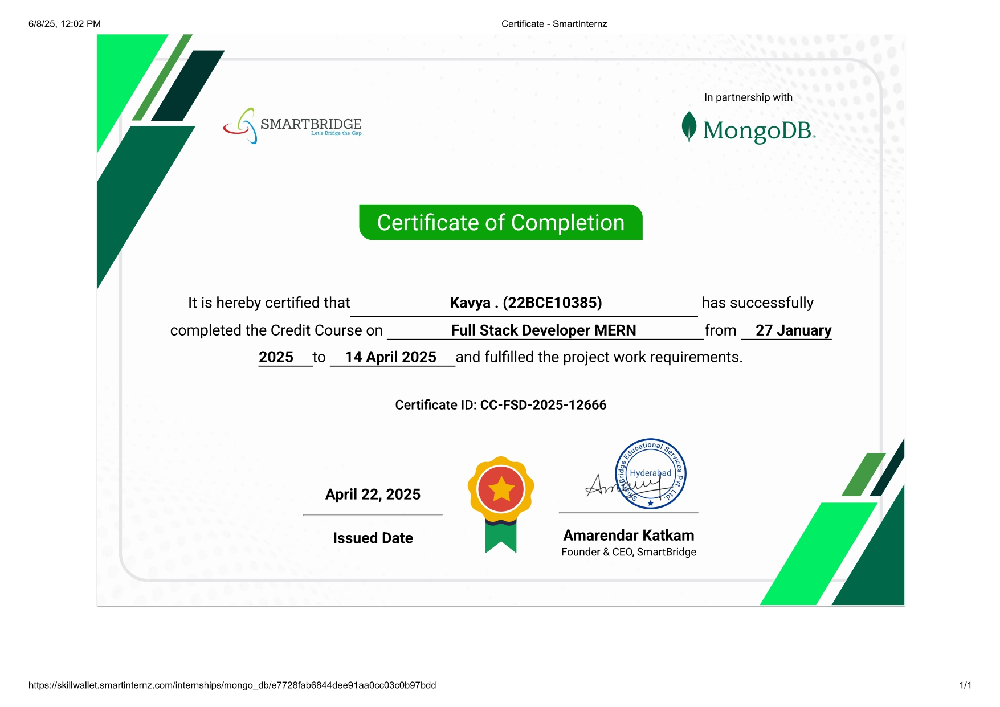

<div align="center">
  
  # Full Stack Developer MERN by SmartBridge-MongoDB
  
  *Comprehensive curriculum, rigorous SDLC documentation, and final project from the Full Stack MERN bootcamp.*
  
  <br />

  
  
  
  
  
  

</div>

<br />

> [!NOTE]  
> This module encompasses the curriculum, extensive SDLC documentation, weekly assignments, and the final project (**SpendSmart**) completed during the rigorous **Full Stack Developer MERN** bootcamp. 

<br/>
<div align="center">
  
</div>

---

## 📸 Application Gallery

### SpendSmart Dashboard Interface
Below is the main tracking interface featuring real-time data visualization charts and recent history modules.

<div align="center">
  
</div>

<br/>

<details>
<summary>Click here to expand the full step-by-step UI walkthrough! (6 Screenshots)</summary>
<br/>

### 1. Authentication Flow
Secure JWT login and registration modules.
<div align="center">
  
  
</div>
<br/>

### 2. Core Dashboard & History
Global state management in action with the React Context API rendering history metrics.
<div align="center">
  
  
</div>
<br/>

### 3. Financial Tracking Modules
Dedicated forms and rendering lists for distinct database collections (Incomes vs Expenses).
<div align="center">
  
  
</div>

</details>

---

## 🌌 Overview & System Features

**SpendSmart** is a robust, full-stack personal finance application. It empowers users to take control of their finances through secure encrypted sessions, granular tracking of monetary flow, and dynamic visual insights.

### Core platform highlights:
* **Secure JWT Authentication:** Encrypted user registration and login flows utilizing `bcrypt.js` hashing and bearer tokens.
* **Global State Management:** Seamlessly orchestrated utilizing the React Context API to ensure real-time updates across sibling components without prop drilling.
* **Real-Time Data Visualization:** Interactive dynamic charts rendering financial health based directly on backend MongoDB aggregates.
* **Extensive SDLC Documentation:** The project is backed by six rigorous phases of documentation including Empathy Maps, Journey Maps, Data Flow Diagrams, and User Acceptance Testing reports.

---

## 🛠️ Technology Stack

| Component | Technology | Description |
| :--- | :--- | :--- |
| **Frontend UI** | React.js, HTML5, CSS3 | Dynamic client interface built with Styled Components. |
| **Backend Engine** | Node.js, Express.js | Fast, unopinionated server managing RESTful routing. |
| **Database** | MongoDB, Mongoose | NoSQL schema validation and relationship mapping. |
| **Security** | JWT, bcrypt.js | Secure stateless authentication protocols. |
| **State Management** | Context API | Built-in React global provider orchestration. |

---

## 🚀 Getting Started

Follow these step-by-step instructions to boot the SpendSmart application on your local machine.

### 1. Backend Initialization
Ensure you have Node.js installed. Open a terminal and navigate to the backend directory:
```bash
cd project-SpendSmart/src/backend

# Install all server dependencies
npm install

# Configure your environment variables
# Create a .env file with your MONGO_URI and JWT_SECRET

# Start the Express server
npm start
```

### 2. Frontend Initialization
Open a second terminal window and navigate to the frontend directory:
```bash
cd project-SpendSmart/src/frontend

# Install all client dependencies
npm install

# Start the React development server
npm start
```

> [!TIP]
> The React development server will automatically open your default browser and launch the application on **`http://localhost:3000`**.

---

## 📚 Course Assignments & Documentation

The course was structured into intensive weekly assignments and deep Software Development Life Cycle (SDLC) documentation:
- **Week 1**: Foundational HTML/CSS structure and styling.
- **Week 2**: Core JavaScript logic (arrays, loops, conditional rendering).
- **Week 3**: Advanced React components, props, and form handling.
- **Week 4**: Building secure backend servers and RESTful APIs using Node.js & Express.
- **SDLC Docs**: Six phases of chronological planning covering Ideation, Requirement Analysis, Planning, Design, Performance Testing, and Final FSD reporting.

---

## 🎓 Certifications Achieved

The rigorous curriculum culminated in the achievement of verified certificates.

<div align="center">
  
  <br/>
  
</div>

<br/>
<div align="center">
  <em>SpendSmart</em>
  <br /><br />
  <p style="font-size: 13px; color: #8b949e; letter-spacing: 0.5px;">&mdash; Engineered by Kavya &mdash;</p>
</div>
