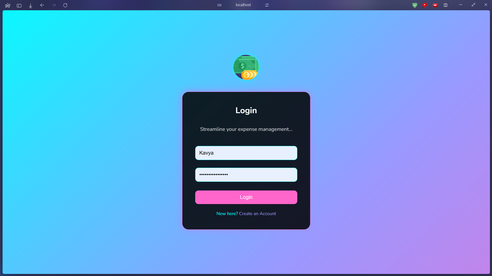
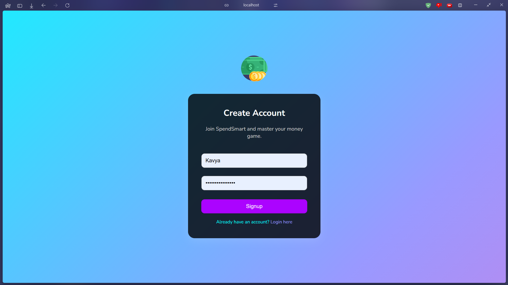
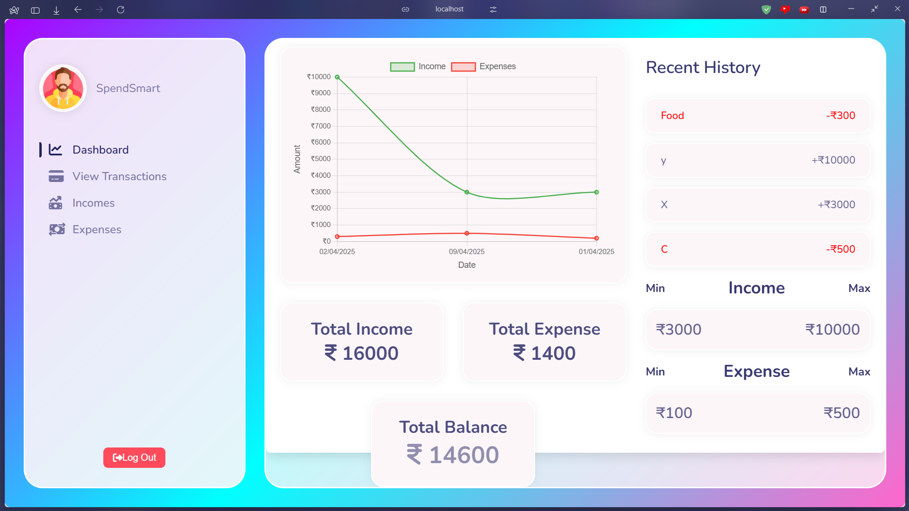
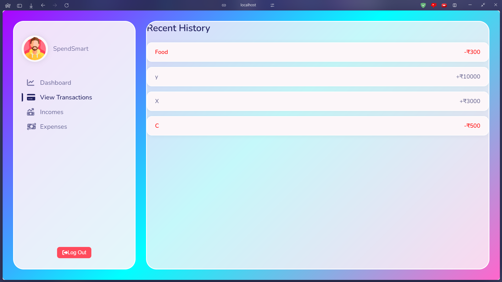
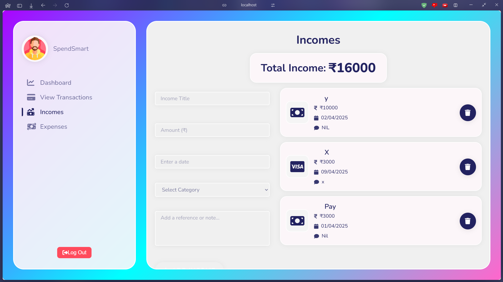
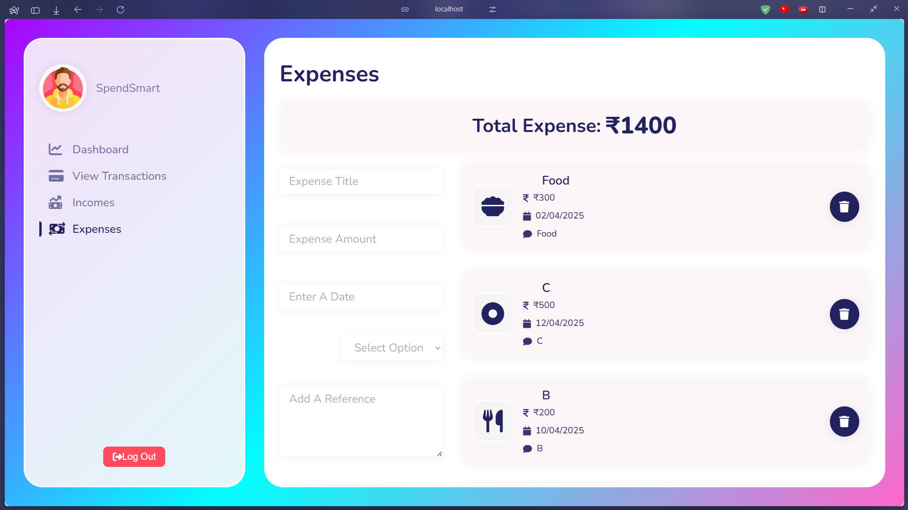

# SpendSmart UI Screenshots

  <h3>1. User Login</h3>
  
  
  <h3>2. User Registration</h3>
  
  
  <h3>3. Main Dashboard & Charts</h3>
  
  
  <h3>4. Transaction History</h3>
  
  
  <h3>5. Incomes Tracking</h3>
  
  
  <h3>6. Expenses Tracking</h3>
  

